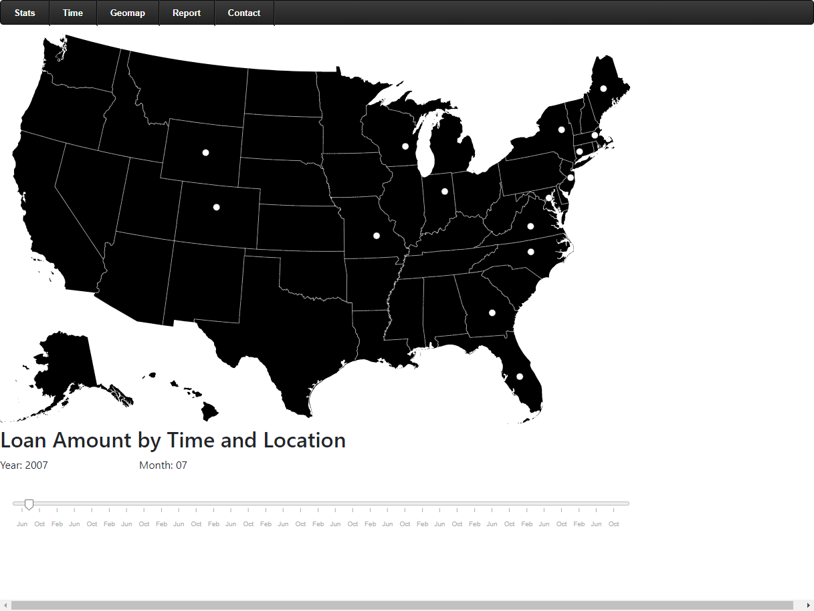
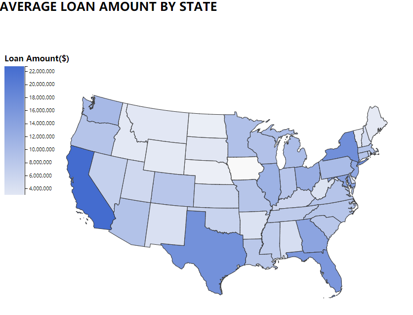
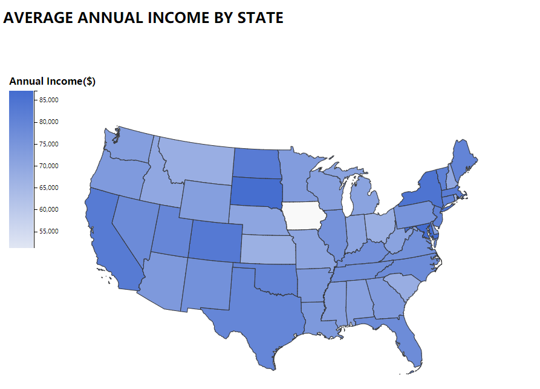
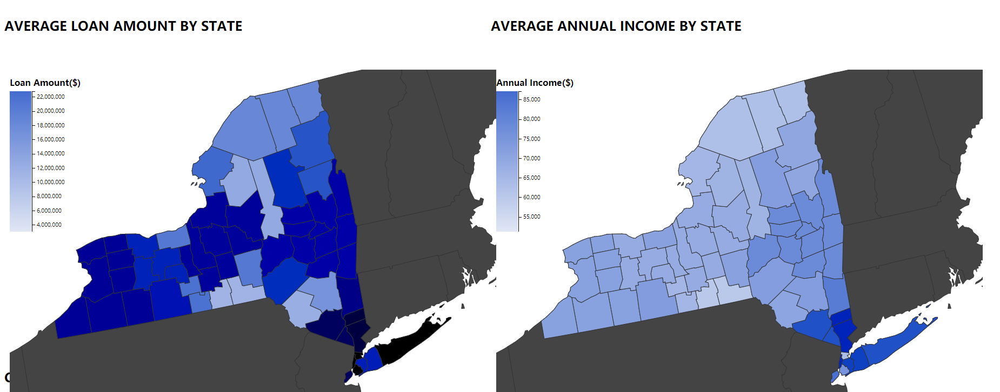

# Results
```{r setup, include=FALSE}
library(choroplethr)
library(choroplethrMaps)
library(DescTools)
library(dplyr)
library(ggplot2)
library(readr)
```


## LendingClub Statistics

```{r car,echo=FALSE}
loan <- read.csv(file="loan.csv", header=TRUE, sep=",")
```

Generally speaking, the amount of loans has a large range. The median of the loan amount is 12,900 dollars, the highest is 400,00 dollars with 33,368 rows corresponding to it and the lowest is 500 dollars with only 11 records getting that. 
Over half of the rows range from 8,000(25% quantile) to 20,000(75% quantile).  

```{r echo=FALSE}
Desc(loan$loan_amnt, main = "Loan amount distribution", plotit = TRUE)
```


Time series: As time goes on, the total amount of loans is increasing. Before 2014 the amount of loans increases steadily, but afterward, it still goes up but fluctuated. In 2016, it hit the peak at over 8.0*10^8 dollars. we could observe there is a significant growth in business since the start of 2012 and from 2014 to 2015Q4, the monthly loan amount and volume have been increasing drastically. However, from the graph we could see the growth during the spikes is very unstable.

```{r pressure, echo=FALSE}
loan$issue_d <- as.Date(gsub("^", "01-", loan$issue_d), format="%d-%b-%Y")
amnt_df <- loan %>% 
  select(issue_d, loan_amnt) %>% 
  group_by(issue_d) %>% 
  summarise(Amount = sum(loan_amnt))
ts_amnt <- ggplot(amnt_df, 
                  aes(x = issue_d, y = Amount))
ts_amnt + geom_line() + xlab("Date issued")
```

Categories:  This dataset classifies all the loans into different categories, from A to G.(The loan grade is the result of a formula that takes into account not only credit score but also a combination of several indicators of credit risk from the credit report and loan application.) 

Grade C gets the most loan, following by B and A. The amount of loan decreases from D to G.

```{r echo=FALSE}
ggplot(loan, aes(x=grade, y=loan_amnt, fill=grade)) +
  stat_summary(fun.y="sum", geom="bar") +
  labs(y ="Total Loan Amount",title="Total loan amount based on loan grade")
```

For distribution of the loan amount using histogram according to the type of loan grade. From this graph, we could observe that all the categories have similar distributions, with the peak of around 12,000. 
```{r echo=FALSE}
ggplot(data=loan,aes(loan_amnt, col=grade))+
  geom_histogram(bins=40) + 
  facet_grid(grade ~ .)
```

For distribution of the loan amount using density plot according to the type of loan grade. We found similar patterns among A, B, C, D, and similar patterns among E, F, G.
```{r echo=FALSE}
ggplot(data=loan,aes(loan_amnt, fill=grade))+
  geom_density(alpha=0.25) + 
  facet_grid(grade ~ .)
```

Time series: we can tell that loan is increasing generally, but like the generall trend, all grades increase unstably after 2014. And the proportion of loans from grade A is increasing dramatically compared to other grades.
```{r echo=FALSE}
amnt_df_grade <- loan %>% 
  select(issue_d, loan_amnt, grade) %>% 
  group_by(issue_d, grade) %>% 
  summarise(Amount = sum(loan_amnt))
ts_amnt_grade <- ggplot(amnt_df_grade, 
                  aes(x = issue_d, y = Amount))
ts_amnt_grade + geom_area(aes(fill=grade)) + xlab("Date issued")
```

From the perspective of purpose, the amount of loan varies across different purposes. Debt consolidation is the main reason for loan, following by creadit card. Loans out of the other reasons are not as much as these two. 

```{r echo=FALSE}
loan_group_by_purpose = aggregate(loan_amnt ~ purpose, data = loan, sum)
ggplot(loan_group_by_purpose, aes(purpose,loan_amnt, fill = purpose)) + geom_col() + scale_x_discrete(breaks=NULL) + labs(subtitle="Distribution of loan Amount for Purpose", 
       x="Purpose", 
       y="Loan Amount",
       title="Bar Plot")
```

Debt consolidation is the main purpose of loans for all grades, taking up over 50% in every grade. The credit card takes more for Grade A, B and C, but not for the rest of grades.

```{r echo=FALSE}
ggplot(data=loan, aes(x=grade, fill=purpose)) +
  geom_bar()   
```

Loan Status:

Fully Paid: Loan has been fully paid off.

Charged Off : Loan for which there is no longer a reasonable expectation of further payments.

Does not meet the credit policy. Status:Fully Paid: While the loan was paid off, the loan application today would no longer meet the credit policy and wouldn’t be approved on to the marketplace.

Does not meet the credit policy. Status:Charged Off: While the loan was charged off, the loan application today would no longer meet the credit policy and wouldn’t be approved on to the marketplace.

Current:	Loan is up to date on current payments.

In Grace Period:	The loan is past due but still in the grace period of 15 days.

Late (31-120 days):	Loan hasn’t been paid in 31 to 120 days (late on the current payment).

Late (16-30 days):	Loan hasn’t been paid in 16 to 30 days (late on the current payment).

Default:	Loan is defaulted on and no payment has been made for more than 121 days.

From the perspective of loan status, fully paid and current are the most common cases, whose proportions are much higher than the others.

```{r echo=FALSE}
Desc(loan$loan_status, plotit = T)
```

For the amount of loan, all the statuses have similar ranges and medians except for Does not meet the credit policy. Status: Fully Paid and Does not meet the credit policy. Status: Charged Off

```{r echo=FALSE}
box_status <- ggplot(loan, aes(loan_status, loan_amnt))
box_status + geom_boxplot(aes(fill = loan_status)) +
  theme(axis.text.x = element_blank()) +
  labs(list(
    title = "Loan amount by status",
    x = "Status",
    y = "Amount"))  
```

## Time Series Analysis

The interactive graph describes the sum of the monthly loan in each state. The radius of the circle shows how large the loan amount is. We can find some patterns from the time-series map. 

- 1. Before 2009, only some states have the data in the loan amount. This might because the loan business was just starting (since the Landing Club company was founded in 2006) or lack of data management.  

   

- 2. From 2009 to 2012, increasing number of states have loans. By 2012, most states have loan records, but the amount of loan is relatively small. Also there is no state that has greatly large amount of loans.   

   

- 3. In 2013 - 2014, we can see that the loan amounts in four states (California, Texas, New York and Florida) have greatly increased compared to other states.  

   

- 4. In recent years, the four states still have the highest loan amount. At the same time, states in the East Coast also have large loan amounts.  
 


## Geographical Distribution of Loan Amount

From the perspective of geography, we chose the following sets of data and their descriptions:

Annual_inc: The self-reported annual income provided by The hostage during registration.

Loan_amnt: The listed amount of the loan applied for by the borrower. If at some point in time, The credit department reduces The loan amount, then it will be reflected in this value.
We created two choropleth maps in the interactive component part.



This choropleth graph shows the average loan amount for counties by states. From the legend, the deeper color of the state, the more loans that state borrowed. We can see that California, New York, Florida and Texas are the states that borrow the most loans. 

This graph is similar to the Map of the U.S. states and the District of Columbia by GDP in recent years.
California, Texas, New York and Florida have both the highest GDP and loan amount. Therefore, the states with larger economies tend to borrow more.

Another reason is that California is the location of Lending Club’s headquarters, so this state has more business.



This choropleth graph shows the average self-reported annual income provided by the borrower during registration by states. From the legend, the deeper the color of the state, the more annual income borrowers in that state report. We want to find out whether the income will affect the loan amount of the state. By comparing two graphs, the data show that for some states, Colorado, South Dakota, North Dakota, Vermont, Connecticut and Massachusetts, the higher the income, the lower the proportion of people who need to borrow. 

Iowa is blank in both graphs, which probably means the Lending club is not a popular lending company in Iowa, therefore we don't have enough data to show the relationship between income and loans borrowing. This graph also shows that the markets of Lending Club’s current business and where potential customers are.

For more detail, we can click on each state zoom in to county-level choropleth graph.



For example, we can compare the loan amount and income for counties in New York State. Comparing two graphs, the counties in the left bottom NY state borrowed a large amount of loans has low annual income.
